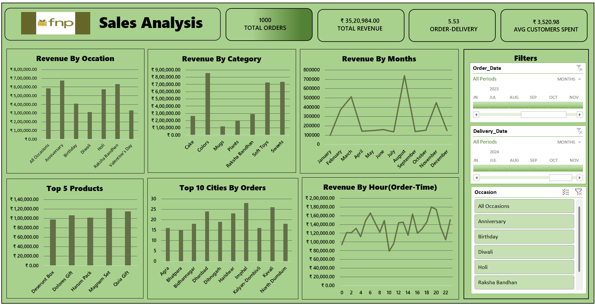

# 🎁 FNP Sales Analysis Dashboard

## 📌 Project Overview

This project analyzes sales data from Ferns N Petals (FNP) to uncover customer purchasing behavior, product performance, revenue trends, and order delivery insights.

Using Excel dashboards, pivot tables, and data visualization techniques, the project transforms raw transactional data into actionable business insights.

---

## 🎯 Business Objectives

The dashboard helps answer key business questions:

- Which products generate the highest revenue?
- What occasions drive the most sales?
- Which months have peak order volumes?
- Which cities contribute the most customers?
- How efficiently are orders delivered?
- What customer segments drive revenue?

---

## 📊 Dashboard Features

### Sales Dashboard
- Total Revenue Analysis
- Revenue by Product Category
- Revenue by Occasion
- Monthly Revenue Trends
- Day-wise Order Analysis
- Order Volume Tracking

### Customer Dashboard
- Customer Distribution by City
- Gender-based Analysis
- Customer Purchase Patterns
- Top Contributing Customers

### Delivery Analysis
- Order-to-Delivery Time Analysis
- Delivery Performance Monitoring
- Occasion-wise Delivery Trends

---

## 🗂️ Dataset Information

The project consists of the following datasets:

### Customers Dataset
Contains customer demographic information.

**Columns:**
- Customer_ID
- Name
- City
- Contact_Number
- Email
- Gender
- Address

### Orders Dataset
Contains transaction and delivery details.

**Columns:**
- Order_ID
- Customer_ID
- Product_ID
- Quantity
- Order_Date
- Order_Time
- Delivery_Date
- Delivery_Time
- Location
- Occasion
- Month Name
- Day Name
- Price (INR)
- Revenue

### Products Dataset
Contains product catalog information.

**Columns:**
- Product_ID
- Product_Name
- Category
- Price (INR)
- Occasion
- Description

---

## 🛠️ Tools & Techniques Used

- Microsoft Excel
- Data Cleaning
- Pivot Tables
- Pivot Charts
- Slicers
- Dashboard Design
- Data Visualization
- Business Analysis

---

## 📈 Key Insights Generated

- Identified top-selling products and categories.
- Analyzed revenue contribution by occasion.
- Tracked monthly sales performance.
- Evaluated customer demographics and locations.
- Measured delivery turnaround times.
- Identified peak order periods.

---

## 📷 Dashboard Preview

### Dashboard Overview

---

## 🚀 Project Outcomes

The dashboard enables:

- Revenue monitoring
- Sales trend analysis
- Customer behavior analysis
- Product performance evaluation
- Delivery performance tracking
- Data-driven business decisions

---

## 💼 Skills Demonstrated

- Data Cleaning
- Excel Analytics
- Business Intelligence
- Dashboard Development
- Data Visualization
- KPI Reporting
- Sales Analysis

